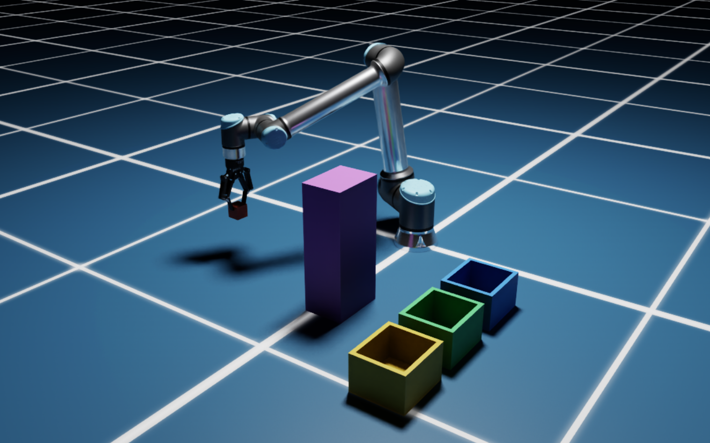

---

# Pick and place assignment

[](https://docs.isaacsim.omniverse.nvidia.com/latest/index.html)
[](https://docs.python.org/3/whatsnew/3.11.html)
[](https://releases.ubuntu.com/22.04/)


This framework is using the Isaac Sim/Lab pipeline, with ROS2 and MoveIt. A docker container has to be built by using the NVIDIA docker environment.
A detailed guide on how to do that is provided below.

## Pre-requisites
The framework is entirely containerized. The host machine has basic requirements such as:

- Git
- Docker and Docker Compose. For their installation refer to [Docker Installation](https://docs.docker.com/engine/install/ubuntu/)
 
 Ensure your system meets the [System Requirements](https://docs.isaacsim.omniverse.nvidia.com/5.1.0/installation/requirements.html) for running NVIDIA Isaac Sim.

## How to

### Clone the repo
Clone the workspace directory. It contains the whole Isaac Sim/lab environment and the ROS2 jazzy workspace:
```bash
git clone 
cd softserve_assignment_ws
```
### Build and run containers
Using the NVIDIA docker framework, we build the containers. The first one ('base') will install Isaac Sim while the second one ('ros2') will provide the ROS2 bridges. I have adjusted the docker compose files in order to build them both by only running:
```bash
sudo python3 docker/container.py start ros2
```
which will pull the images and build the containers.
To enter the ros2 container, run:
```bash
sudo python3 docker/container.py enter ros2
```
where the working directory is already in the jazzy workspace. 

From here, the packages can be built via ROS2. Please follow the guide in the related package [manipulator_sim](https://github.com/TassiF/softserve_assignment_ws/tree/master/jazzy_ws/src/manipulator_sim).

### Stop containers
To stop the runninng container and empty the docker volumes, use:
```bash
sudo python3 docker/container.py stop ros2
```
Finally remove the relative docker images using `docker rmi <img_name>`.

## Troubleshooting
For any issue in building and running the docker containers through the NVIDIA framework, refer to [Container Installation](https://docs.isaacsim.omniverse.nvidia.com/5.1.0/installation/install_container.html#isaac-sim-app-install-container).

## Hardware
Tested using:
- CPU: 16 cores Intel(R) Core(TM) Ultra 7 255H
- GPU: NVIDIA RTX PRO 500 Blackwell Generation Laptop GPU" (6 GiB, sm_120, mempool enabled)


## Isaac Documentation

For further documentation related to the Isaac environment, refer to NVIDIA official website:
- [Documentation page](https://isaac-sim.github.io/IsaacLab)
- [Container Installation](https://docs.isaacsim.omniverse.nvidia.com/5.1.0/installation/install_container.html#isaac-sim-app-install-container)
- [Installation steps](https://isaac-sim.github.io/IsaacLab/main/source/setup/installation/index.html#local-installation)


## IsaacSim/Lab licensing

The Isaac Lab framework is released under [BSD-3 License](LICENSE). The `isaaclab_mimic` extension and its
corresponding standalone scripts are released under [Apache 2.0](LICENSE-mimic). The license files of its
dependencies and assets are present in the [`docs/licenses`](docs/licenses) directory.

Note that Isaac Lab requires Isaac Sim, which includes components under proprietary licensing terms. Please see the [Isaac Sim license](docs/licenses/dependencies/isaacsim-license.txt) for information on Isaac Sim licensing.

Note that the `isaaclab_mimic` extension requires cuRobo, which has proprietary licensing terms that can be found in [`docs/licenses/dependencies/cuRobo-license.txt`](docs/licenses/dependencies/cuRobo-license.txt).